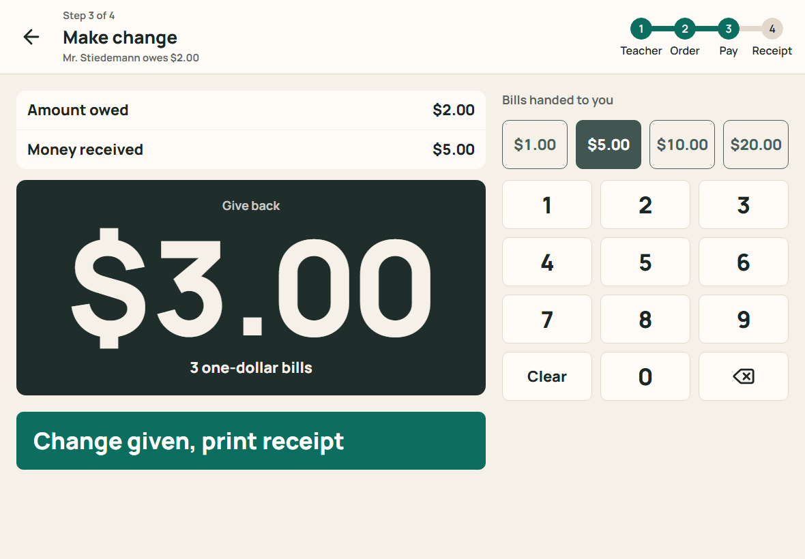
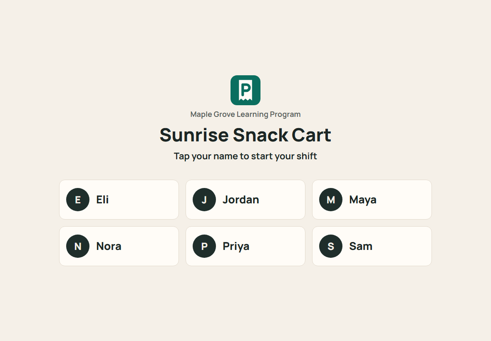
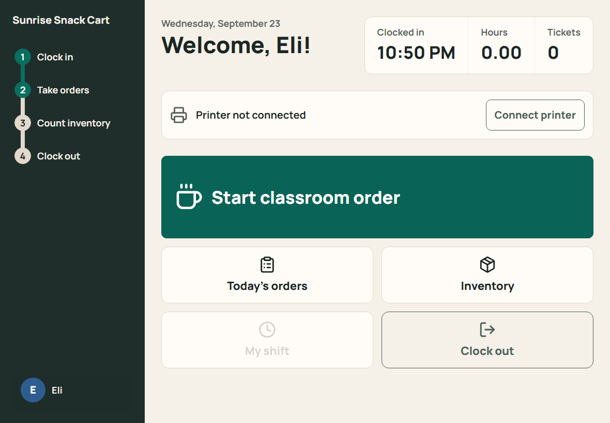
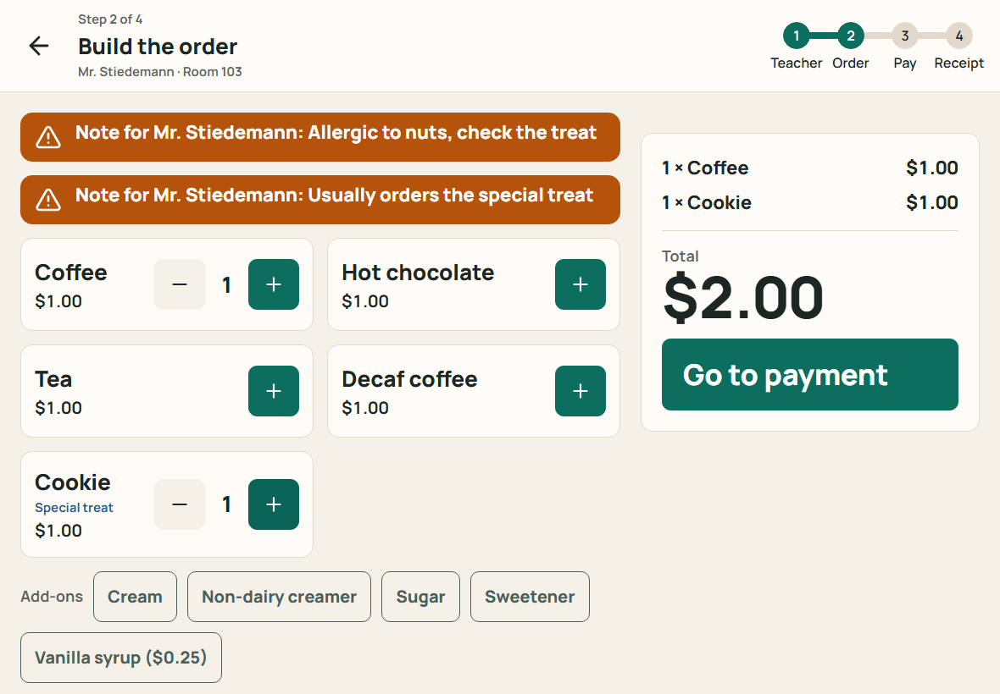
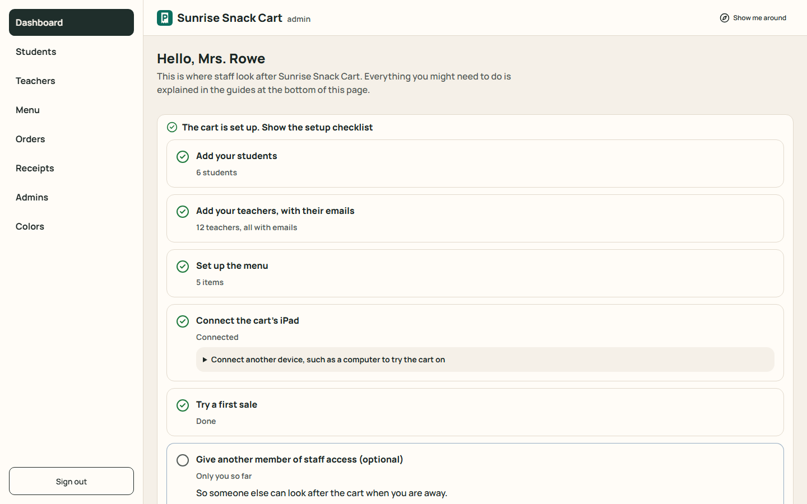
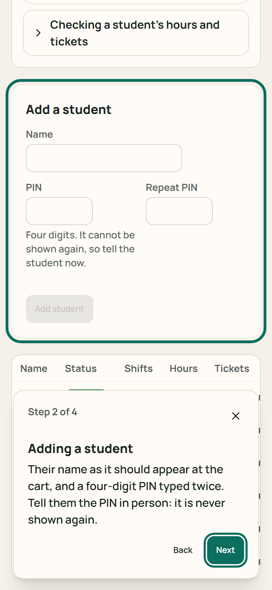
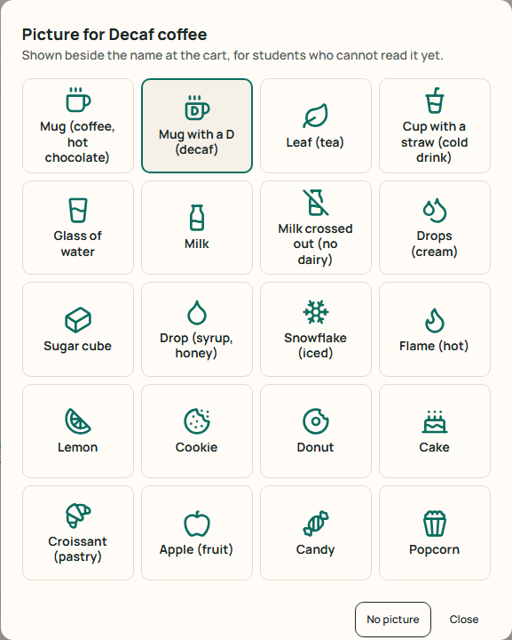

# PocketClerk

[](https://github.com/colinhendrickson/pocketclerk/actions/workflows/ci.yml)
[](LICENSE)

A white-label point-of-sale and workforce-training app for student-run carts.
Students clock in, take orders from customers they learn to remember, count
change, print receipts, and clock out to earn simulated wages.

The first deployment is a special-education work program at a K-8 school, where
it runs on the cart's iPad with a $30 Bluetooth receipt printer. The app ships
brand-neutral: names, logo and reward currency are deployment config, and staff
set the school's color themselves, so another program can run it without
touching code.

**Try it:** [pocket-clerk.com](https://pocket-clerk.com) is a live demo on
made-up data. Take an order as a student (every PIN is 1234), or look around
the admin side. Everything resets every hour.



---

## Why it looks the way it does

The primary users are students with disabilities, so accessibility was a
constraint on the architecture rather than a finishing pass. It decided the
information architecture:

- One primary action per screen. The app advances itself to the next step.
- Touch targets at least 60px. No hover-only affordances.
- Sentence case on student screens, even where the deployment's brand style uses
  capitals, because capitals measurably slow emerging readers.
- The change amount is the largest text in the app and appears at that size
  nowhere else. On a narrow screen it shrinks to fit its card rather than be cut
  off.
- No free-text entry anywhere in the student flow except teacher notes.
- Menu items and add-ons can carry a picture beside the name, for students who
  cannot read the words yet: line icons from a fixed set, not emoji, which look
  different on every device.

The whole app, student and staff sides, meets WCAG 2.2 AA, and that is tested
rather than reviewed: see [Testing](#testing).

| | |
|---|---|
|  |  |
| Tap your name. No typing, no dropdown. | Four steps of a shift, one primary action. |



Saved notes about a customer render above the menu and cannot be collapsed.
Remembering the customer is one of the program's stated goals, so the layout
enforces it rather than trusting the student to look. The pictures beside the
names were asked for by the program's teacher; decaf gets a mug with a D.
→ [ADR 15](docs/adr/0015-menu-pictures.md)

## For the staff who run it

Several staff share the admin side, and some open it a few times a term, so it
explains itself. Admin home has a setup checklist that ticks itself off from the
real data, and a searchable list of every guide. Every page opens with "About this page"
and the tasks people come to it for, and a "Show me around" tour walks through
it. Staff add each other on the Admins page and set the school's color on the
Colors page; neither needs a developer.

| | |
|---|---|
|  |  |
| The setup checklist, from students to a first sale. | "Show me around", on a phone. |



Staff choose a picture for each item from a grid; there is nothing to type.

## Architecture

Every architectural decision has a record in [`docs/adr/`](docs/adr) covering the
constraint that forced it and what it costs. The ones that carry the design:

**Money is integer cents, everywhere.** No `numeric` column, no float, no
exceptions. Hours are integer hundredths. Formatting happens in exactly one
function, called only from components. The money module imports neither the
database nor React, so its tests run with no mocks.
→ [ADR 1](docs/adr/0001-money-as-integer-cents.md)

**Receipts are queued, not sent inline.** Completing an order writes the order,
its lines and its receipt jobs in one transaction containing no network calls. A
dead printer or dropped WiFi delays a receipt and never costs a sale.
→ [ADR 2](docs/adr/0002-receipt-job-queue.md)

**Row Level Security is the floor, not the student authorization layer.**
Students have no database identity by design, so RLS closes the public surface
while the server enforces student scope against a signed session cookie, on a
device that has been paired to the cart.
→ [ADR 3](docs/adr/0003-rls-and-the-trust-boundary.md),
[ADR 10](docs/adr/0010-device-pairing.md)

**Invariants live in the database.** One open shift per student is a partial
unique index, because two concurrent requests can both pass an `if` but cannot
both satisfy a unique index. An order whose change does not add up is
unrepresentable, not merely rejected. Both are asserted by tests that name the
constraint that fires.
→ [ADR 4](docs/adr/0004-invariants-in-the-database.md)

**Effects sit behind interfaces.** Printing, email and rendering are provider
interfaces in `src/providers/`. Each has a console implementation that is the
default when no key and no hardware are present, so a fresh clone can complete
an order and see the receipt it would have produced.
→ [ADR 13](docs/adr/0013-providers-for-every-effect.md)

**Themes are data, and the school's color is the school's.** No component names
a color. Staff choose the main color on the Colors page; it is stored in the
deployment's own database, and a color that would make text hard to read is
refused with a darker one offered.
→ [ADR 6](docs/adr/0006-themes-as-data.md),
[ADR 11](docs/adr/0011-staff-chosen-main-color.md)

**Sign-in is an emailed single-use code, issued in-process.** No password for
staff who sign in a few times a term, and no hosted auth dependency. Only hashes
are stored, a code is redeemed in a single guarded statement, and the form gives
the same answer whether or not an address is an administrator.
→ [ADR 7](docs/adr/0007-self-hosted-sign-in-links.md)

**The admin side's help is code, tested against the app.** Guides, page help,
the checklist and the tour read one typed module, and tests fail if a guide
points at a page or a button that no longer exists.
→ [ADR 12](docs/adr/0012-help-in-code-and-tested-accessibility.md)

### The printer is attached to the tablet, not the network

This shaped the receipt queue. iPadOS refuses classic Bluetooth
to anything without MFi certification, and MFi printers start around $250, so the
only affordable printer a web page can reach is a Bluetooth Low Energy one,
driven from the browser. Print jobs are therefore claimed by the tablet and email
jobs by the server, which is why `ReceiptPrinter` carries a `runsOn` field.

Safari has no Web Bluetooth, so on the iPad the cart runs in
[Bluefy](https://apps.apple.com/us/app/bluefy-web-ble-browser/id1492822055), a
free browser that does. Cheap ESC/POS boards are sold under many names and
disagree about which GATT service carries the writable characteristic, so the
driver probes a list of known candidates rather than hard-coding one vendor.
→ [ADR 9](docs/adr/0009-receipts-over-web-bluetooth.md)

### A production bug worth reading

The first deployment's admin pages hung for five minutes each. The cause was
Supabase's transaction pooler splitting postgres.js's two-step parameterized
queries, found by reading `pg_stat_activity` while a page was stuck, after two
fixes built on reasoning alone had missed.
→ [ADR 8](docs/adr/0008-session-pooler-and-idle-connections.md)

## Testing

337 Vitest cases across 41 files, and 36 Playwright tests across 12 specs.

The coverage is deliberately uneven. `src/lib/money.ts` has the most tests
because a bug there teaches a student the wrong answer in front of a customer.

**The database suite** runs against a real Postgres and asserts that Postgres
itself refuses a second open shift, an order whose change does not equal received
minus total, a payment that does not cover the total, and a half-closed shift.
Each assertion names the SQLSTATE code and the constraint that fired. Races are
tested as races: twenty parallel wrong PINs lock the student after exactly five,
and two administrators removing each other at once never leave none.

**The browser suite** drives a real browser through a whole shift, reloading after
clock-out so the summary has to come from the database. It walks every screen at
five sizes, from a 320px phone to a desktop, failing on sideways scroll or a
change amount cut off, and runs axe against WCAG 2.2 A and AA on each. What axe
cannot judge is tested by keyboard: the skip link, focus after navigation, the
menu drawer, the tour.

The public demo runs as a second Playwright project, on its own server and its
own database, so its resets never touch the data the other specs use.

A test written for a bug is run against the old code first, to show it fails.

## Stack

Next.js 16 (App Router) · TypeScript · Tailwind 4 + daisyUI 5 · Postgres
(Supabase, through its session pooler) via Drizzle and postgres.js · Resend ·
Web Bluetooth · Vitest · Playwright with axe-core · Vercel

## Run it locally

Requires Node 22.12+, pnpm and Docker. No cloud account, no API keys.

```bash
pnpm install
cp .env.example .env.local
pnpm db:up && pnpm db:migrate && pnpm seed
pnpm dev
```

Open http://localhost:3000 and sign in as any student; every seeded PIN is
`1234`. Receipts print to the console, because no printer is attached.

For the admin side, go to http://localhost:3000/admin/sign-in and use the
administrator's email that `pnpm seed` prints. With no email key set, the
sign-in code appears in the dev server's output.

| Command | Does |
|---|---|
| `pnpm dev` | Development server |
| `pnpm check` | Typecheck, lint, and the unit and database tests |
| `pnpm test:e2e` | Playwright: a whole shift, every screen at five sizes with axe, keyboard, tour, colors, prices, admin access, and the demo on its own database |
| `pnpm build` | Production build |
| `pnpm db:up` / `db:down` | Local Postgres in Docker |
| `pnpm db:migrate` | Apply migrations |
| `pnpm seed` | Fake data, fixed seed, reproducible. Never in production |
| `pnpm admin:add "Name" email` | The first administrator on a new deployment |
| `pnpm icons` | Re-render the favicon and app icons from `src/lib/logo.ts` |

CI runs typecheck, lint, migrations, seed, the unit and database tests, and the
build against a real Postgres on every push, with the browser suite as a second
job. If `pnpm test:e2e` shows Next.js 404 pages for routes that exist, a
production build has left files in `.next`; delete it and run again.

## Project layout

```
src/app/          routes and server actions only
  (student)/      the cart: sign-in at /cart, shift, order, change, inventory, clock-out
  (admin)/admin/  the staff side, and _help/ (guides, page help, tour)
  demo/           the public demo's actions: admin entry, Start over
  landing.tsx     the landing page, shown at / in demo mode
src/lib/          business logic, importable without Next.js (money, colors,
                  help content, setup checklist, sign-in, settings)
src/providers/    printer, email and renderers behind interfaces
src/db/           schema, client, seed (also the demo's hourly reset)
drizzle/          migrations, each with its RLS and constraints
scripts/          icon rendering, and the demo's test database
tests/            Vitest (unit and database) and tests/e2e (Playwright)
docs/             game plan, design system, ADRs, deployment and iPad guides
```

## Deploying

Each school runs its own copy: its own Vercel project and database, on its own
subdomain. pocket-clerk.com is the same code in demo mode
([ADR 14](docs/adr/0014-one-copy-per-school-and-a-demo.md)).

See [`docs/DEPLOYMENT.md`](docs/DEPLOYMENT.md). After deploying, `/api/health`
reports whether the app is configured: which required settings are missing by
name, whether the database is reachable, and whether migrations have run.

## White-label

Branding is configuration with fictional defaults. A deployment supplies its own
values through the environment; nothing school-specific is committed.

| Config | Repo default |
|---|---|
| `NEXT_PUBLIC_PROGRAM_NAME` | Maple Grove Learning Program |
| `NEXT_PUBLIC_CART_NAME` | Sunrise Snack Cart |
| `NEXT_PUBLIC_REWARD_NAME` | Tickets |
| `NEXT_PUBLIC_LOGO_URL` | The PocketClerk mark, in the sign-in email |
| `NEXT_PUBLIC_TIME_ZONE` | America/New_York |
| `NEXT_PUBLIC_SITE_MODE` | `instance`, a school's copy; `demo` only for pocket-clerk.com |
| Main color | The pocketclerk theme's teal; staff change it on the admin Colors page |

Visit `/themes` to see the same components under both committed themes.

## Documentation

| Document | Contents |
|---|---|
| [`docs/GAME_PLAN.md`](docs/GAME_PLAN.md) | Goals, data model, every ticket and its status |
| [`docs/DESIGN.md`](docs/DESIGN.md) | Design system: themes, type scale, breakpoints, primitives |
| [`docs/adr/`](docs/adr) | Architecture decision records |
| [`docs/specs/`](docs/specs) | Design specs for larger pieces of work |
| [`docs/DEPLOYMENT.md`](docs/DEPLOYMENT.md) | Deploying to Vercel and Supabase, free tier |
| [`docs/IPAD_SETUP.md`](docs/IPAD_SETUP.md) | One-page iPad guide for whoever runs the cart |
| [`CONTRIBUTING.md`](CONTRIBUTING.md) | How to run, check and contribute |
| [`SECURITY.md`](SECURITY.md) | Reporting a vulnerability privately |

## Status

The student side is complete: sign in, clock in, take classroom orders, count
change or check a teacher's staff card, print or email the receipt, view today's orders, count the inventory,
restock, work the closing checklist, clock out.

The staff side has sign-in, a dashboard with the setup checklist and every guide,
management of students, teachers, the menu (with pictures), inventory supplies,
administrators and the site's color, an orders browser and a receipt delivery monitor with retry.

The first school runs its own copy on a subdomain, and pocket-clerk.com is the
public demo, reset every hour.

Payroll, reports and the export are next. See
[`docs/GAME_PLAN.md`](docs/GAME_PLAN.md).

## License

[MIT](LICENSE).
